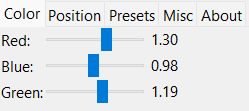

<h1 align="center">
   
  IW4 Sun Controller
   
</h1>

  
  
  

<h4 align="center">A Sun Controller & Modifier for IW4x & IW4m</a>!</h4>

  

## Installation

1. Download the latest version from **releases**. -->
2. Join a mw2 game or load a demo
3. Open iw4suncontroller.exe
4. Done!

  

## Support

| Name | Status |
| --- | --- |
| IW4x | Yes |
| IW4m | Yes |
| Mw2 | ? |

## Todo

* See if it works on stock mw2 and add support (who even uses that tho)
* Add brightness calculator to main release(uses a lot of CPU usage currently)

## Credit

- [Gmzorz](https://youtu.be/GBZYLdMKc3s) for finding the addresses.
- [Undo](https://www.youtube.com/UndoVFX) for making the logo/icon.

---

**Please contact me if you find any bugs or have any suggestions.**
#### Twitter: @kruumy
#### Discord: kruumy#9443

